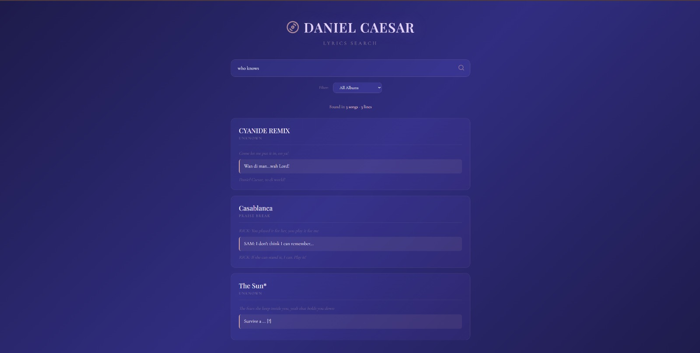

# 🎵 Daniel Caesar Lyrics Search

A full-stack web application for searching through Daniel Caesar's complete discography with fuzzy string matching and an elegant, minimalist interface.

[Live Demo](https://daniel-caesar-lyrics-finder.vercel.app/) | [API Endpoint](https://daniel-caesar-lyrics-api.onrender.com/)



## ✨ Features

- **Fast Fuzzy Search**: FuzzyWuzzy-based search algorithm that handles typos and partial matches
- **Complete Discography**: Search across all Daniel Caesar albums and songs
- **Contextual Results**: See the lyrical context around your search matches
- **Beautiful UI**: Clean, responsive design inspired by Daniel Caesar's aesthetic
- **Real-time Highlighting**: Search terms are highlighted in results

## 🛠️ Tech Stack

**Frontend:**
- React + Vite
- Modern CSS with responsive design
- Deployed on Vercel

**Backend:**
- FastAPI (Python)
- FuzzyWuzzy for string matching
- CORS-enabled REST API
- Deployed on Render

## 🚀 Getting Started

### Prerequisites
- Node.js (v16+)
- Python 3.8+
- npm or yarn

### Frontend Setup
```bash
cd frontend
npm install
npm run dev
```

The frontend will run on `http://localhost:5173`

### Backend Setup
```bash
cd backend
python -m venv venv
source venv/bin/activate  # On Windows: venv\Scripts\activate
pip install -r requirements.txt
uvicorn main:app --reload
```

The API will run on `http://localhost:8000`

## 📁 Project Structure
```
daniel-caesar-lyrics/
├── frontend/          # React frontend
│   ├── src/
│   ├── package.json
│   └── vite.config.js
├── backend/           # FastAPI backend
│   ├── main.py
│   ├── requirements.txt
│   └── data/         # Lyrics data
└── README.md
```

## 🎯 Key Learnings

This project helped me develop skills in:
- Building RESTful APIs with FastAPI
- Implementing efficient search algorithms
- Creating responsive React applications
- Full-stack deployment (Vercel + Render)
- Git workflow and version control

## 🔮 Future Enhancements

- [ ] Implement search history
- [ ] Add audio preview integration
- [ ] Dark mode toggle
- [ ] Advanced search operators

## 👨‍💻 About Me

Built by Samudera | Data Science @ UCSD

[LinkedIn](https://www.linkedin.com/in/aubreyasta/) • [GitHub](https://github.com/aubreyasta) • [Instagram](https://www.instagram.com/aubreyasta_/)

## 📄 License

This project is for educational purposes. Lyrics are property of their respective copyright holders.

---

⭐ Star this repo if you like it!
```